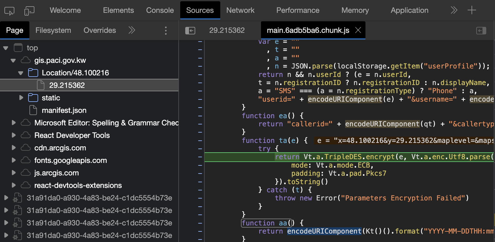

# Kuwait PACI Unofficial REST API

[Link to Demo with Google Maps](#)

## Get an Address Given a Long/Lat

> too lazy to write proper documentation. here is rough draft below on how it works. Or check [src/get-paci-data.ts](src/get-paci-data.ts)

Example request:

https://kfappsrv.paci.gov.kw/kuwaitfinder/server/api/search/identify?params=JNTH7hVI%2BuLjw8cKOTjVKY989P%2FeozxhItA8DCVJ7YOLnbXzccIfzIG2OLxrsRbIqD5DFyxnNIui0nN8DS0V3WOOZv8GoLe0McXdrHCFGIUKU1sew1wm89l6xk6qwqmTMRIocfAH5IAbtTBBtN7TigaLO0VwT25Ja8bacRF7UpjFRbipqQF5I1oTX5WhaBUIb%2F2em%2FXomb009g8EQrkTc7nSbm%2FrfY%2FS%2B5K8wF7EJRDsZWhOK4YePBctCZhkdgtNGb8BMYwLeWy%2FlGigEBsldD2iRbgIiZ%2F0H686lMMk87z4HmmZbhx3inJNziRjDPKX2jNyE5gig%2FS5dIGTEVYBVKBU%2BWUkqz%2Fvm2JwzgB%2FuxqkeK3gwLHnB9RZyLdOFpr5Yg4ZeExIUtm9Nqt9kSGJ6bisN1PekPC8TsZoAMiE9PQeDW3kUhGyDF3PTttzsUEH9fQQEAOi2MCqxKtbAhXQX1f5E3Qng0OKkf%2BUrM1Cd2ONquBDCpPK7F%2FkxCuzseHXzqbCM01eH02uW%2F4bhQHe1tBYAtnatYFgs76VT%2BeAMzVLVfijeMgab%2FvWcPZ%2Bw75j4%2F6bH6EaqiP5ME0idv4isHiKI4GRl1rOeYH22hqcr%2F6qPiEEBw%2FDGy3e22H0wC%2F3yO0jY80jSD6P1tUfWrDJtnKpkHQSucM4vyHO%2BKMDsDbRjRD77X0V%2BXBmNfkJ2Mpb9gwG4KpOXl0%3D

How to construct `params` query parameter:

### 1. Build the query parameters

Below is an example I got from Chrome Dev tools when you visit https://gis.paci.gov.kw/Location/48.100216/29.215362

```ini
x=48.100216
&y=29.215362
&maplevel=
&mapscale=2256.994353
&xmin=47.77940063476482
&ymin=28.857864462816597
&xmax=47.820599365233555
&ymax=29.863234359727123
&language=ar
&currentlocationx=
&currentlocationy=
&userid=
&username=
&userlogintype=
&callerid=178.61.224.228
&callertype=Chrome
&callerversion=undefined
&calleros=Mozilla%2F5.0%20(Macintosh%3B%20Intel%20Mac%20OS%20X%2010_15_7)%20AppleWebKit%2F537.36%20(KHTML%2C%20like%20Gecko)%20Chrome%2F115.0.0.0%20Safari%2F537.36%20Edg%2F115.0.1901.188
&requesttime=2023-08-09T22%3A09%3A50%2B03%3A00
```

### 2. Encrypt the Query Parameters

You can find out how it's encrypted also from Chrome Dev tools.

)

### 3. Encode Encrypted Query Parameters for URI

use `encodeURIComponent` to encode the encrypted data

### 4. Fetch from PACI

```javascript
const queryParams = 'x=48.100216&y=29.215362&maplevel=....'
const encryptedQueryParams = tripleDESEncryption(queryParams, ENCRYPTION_KEY)
const encoded = encodeURIComponent(encryptedQueryParams)
const result = await fetch(`https://kfappsrv.paci.gov.kw/kuwaitfinder/server/api/search/identify?params=${encoded}`)
```
